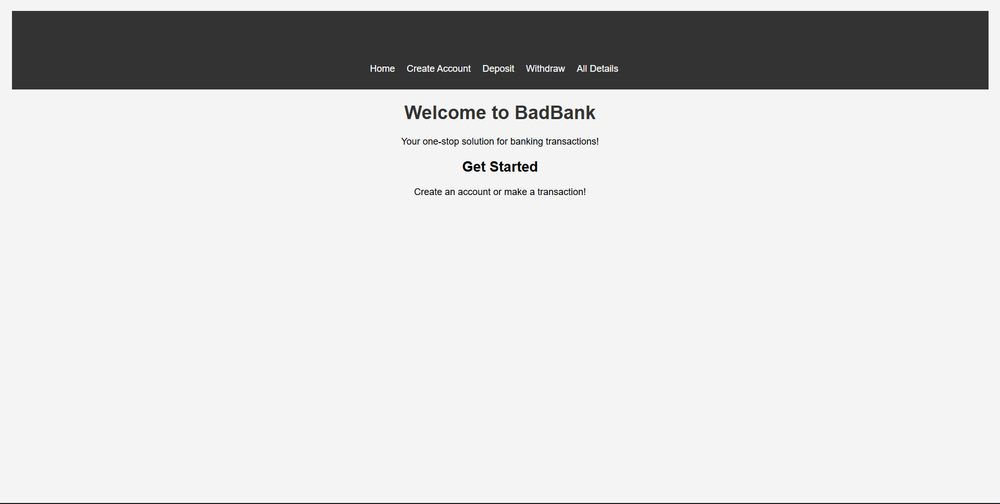
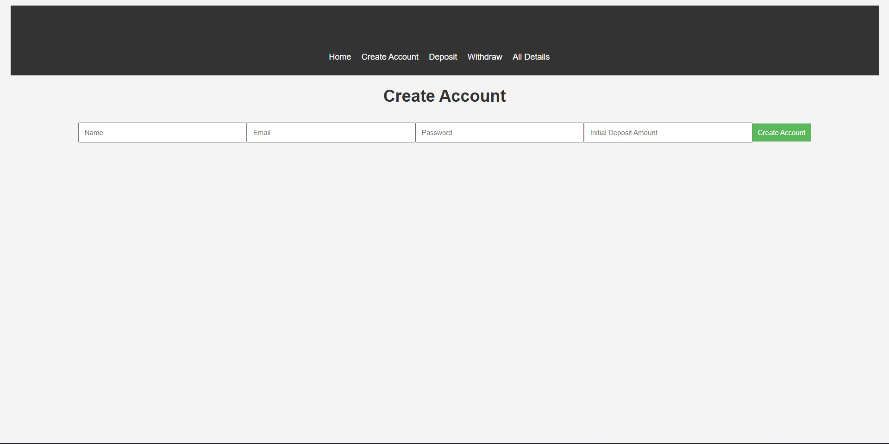
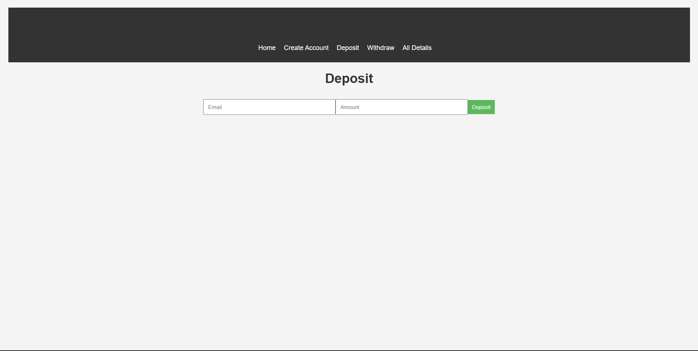
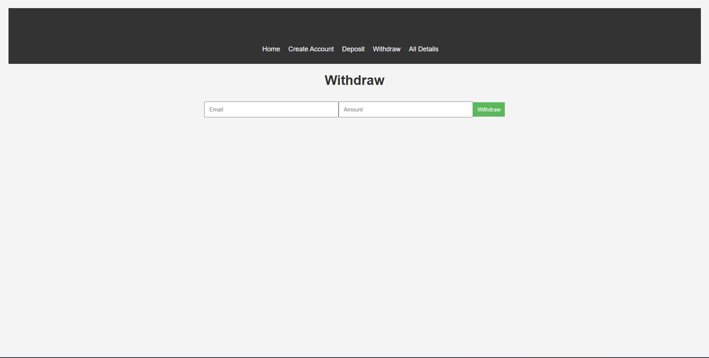

# Bad Bank Project

A simple React-based banking application developed as part of the MIT Fullstack Development with MERN program.

## 🚀 Project Overview

The Bad Bank application serves as a capstone project for Module 2 of the MIT Fullstack Development with MERN program. It is designed to demonstrate core React concepts, including hooks, context, routing, and form validations. The application intentionally exposes user data in the UI to simulate real-world scenarios. Additionally, it showcases the deployment of a React application using AWS S3 Buckets.

## 🛠️ Features

Account Management: Create, edit, and delete user accounts.

Authentication: Login and logout functionality.

Transactions: Deposit, withdraw, and view transaction history.

Charts: Visual representation of account balances and transaction trends.

## ⚙️ Technologies Used

React JS

Formik

Yup Schema Validation

React Toastify

Material UI

Bootstrap

ChartJS

## 🧪 Installation & Setup

### Clone the repository:

git clone https://github.com/SuryaR1807/BAD-BANK

### Navigate into the project directory:

cd Bad-bank-project

### Install dependencies:

npm install

### Start the development server:

npm start

Open http://localhost:3000
 in your browser to view the application.

## ScreenShots

### Home page

### Create Account Page

### Deposit Page

### Withdraw Page

### All Data Page

## 📦 Deployment

### The application is deployed using AWS S3 Buckets. You can access the live version here:

Bad Bank

## 🧠 Future Enhancements

Implement backend services for persistent data storage.

Allow users to upload and manage their avatars.

## 🧑‍💻 Author

Kevin Grimaldi
Student at MIT Fullstack Development with MERN

## 📄 License

This project is licensed under the MIT License.

